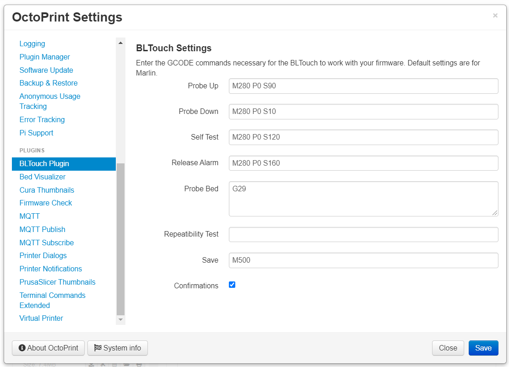

# OctoPrint-BLTouch

A simple plugin to add buttons on the control tab to manage BLTouch. This plugin does not do auto bed leveling or utilize your BLTouch in any way to probe your mesh. It is just a utility plugin that adds buttons to the control tab that allows you to send the required GCODE commands to your printer to interact with the BLTouch probe. If you are looking for what those commands should be you should check the [manual](https://www.antclabs.com/manual) for the version of BLTouch that you have.

## Setup

Install via the bundled [Plugin Manager](https://github.com/foosel/OctoPrint/wiki/Plugin:-Plugin-Manager)
or manually using this URL:

    https://github.com/jneilliii/OctoPrint-Bltouch/archive/master.zip

## Settings

## Get Help

If you experience issues with this plugin or need assistance please use the issue tracker by clicking issues above.

### Additional Plugins

Check out my other plugins [here](https://plugins.octoprint.org/by_author/#jneilliii)

### Sponsors
- Andreas Lindermayr
- [@Mearman](https://github.com/Mearman)
- [@TheTuxKeeper](https://github.com/thetuxkeeper)
- [@tideline3d](https://github.com/tideline3d/)
- [OctoFarm](https://octofarm.net/)
- [SimplyPrint](https://simplyprint.dk/)
- [Andrew Beeman](https://github.com/Kiendeleo)
- [Calanish](https://github.com/calanish)
- [Lachlan Bell](https://lachy.io/)
- [Johnny Bergdal](https://github.com/bergdahl)
- [Leigh Johnson](https://github.com/leigh-johnson)
- [Stephen Berry](https://github.com/berrystephenw)
- [Guyot François](https://github.com/iFrostizz)
- [Steve Dougherty](https://github.com/Thynix)
## Support My Efforts
I, jneilliii, programmed this plugin for fun and do my best effort to support those that have issues with it, please return the favor and leave me a tip or become a Patron if you find this plugin helpful and want me to continue future development.

 

<small>No paypal.me? Send funds via PayPal to jneilliii&#64;gmail&#46;com</small>
